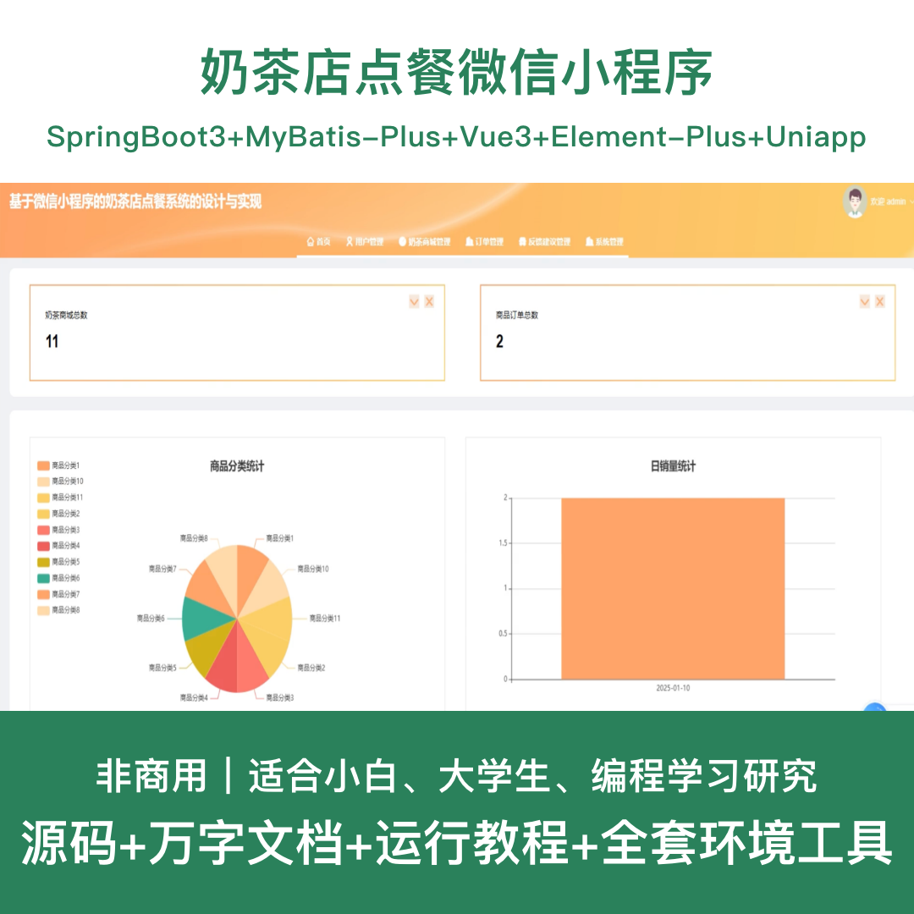
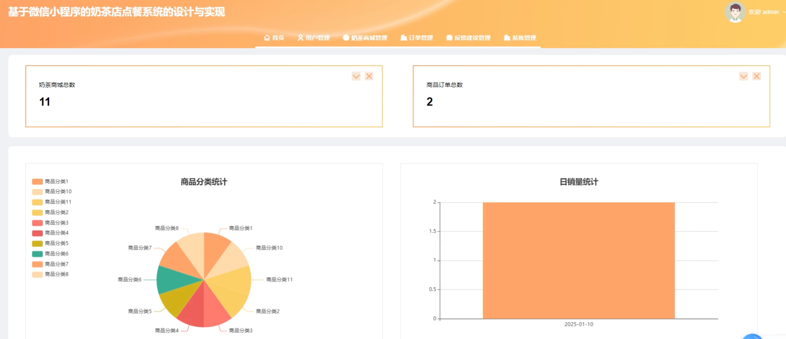
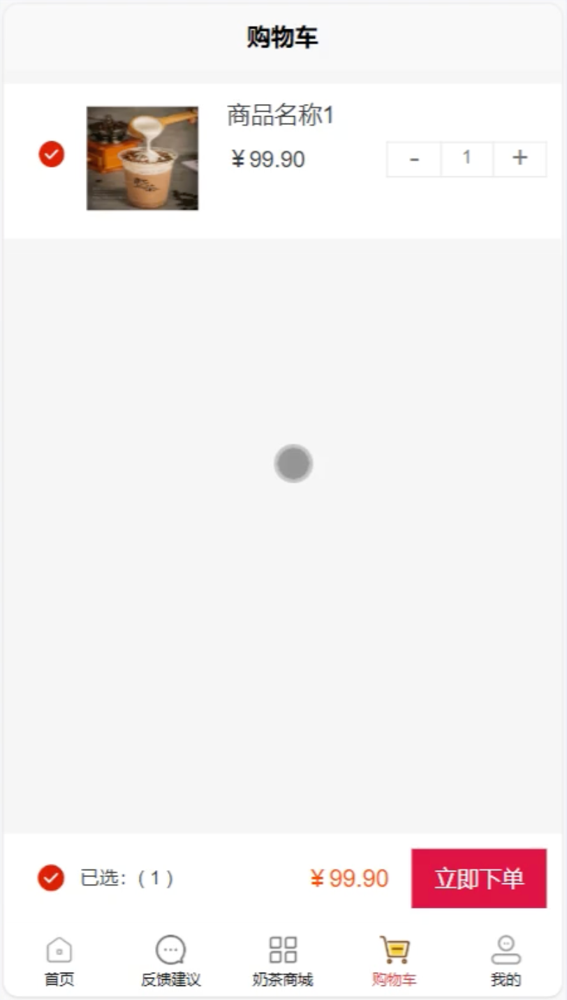
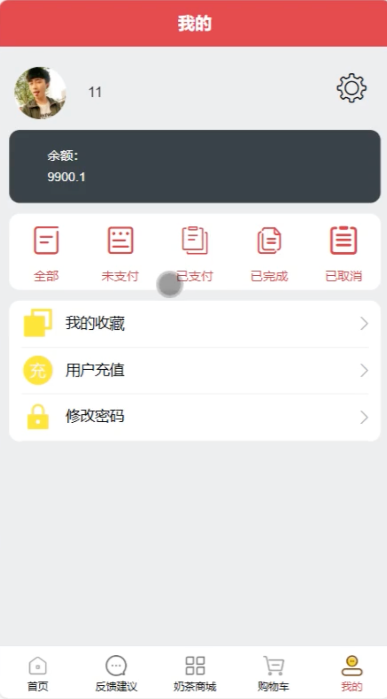

# mpweixinA228D
mpweixinA228D奶茶店点餐微信小程序+LW

## 源码问题查看主页咨询

### 一、关键词
奶茶店系统、奶茶点餐系统、饮品店系统、茶饮店系统、奶茶商城系统

### 二、作品包含
源码+数据库+万字设计文档+全套环境和工具资源+本地部署教程

### 三、项目技术
前端技术：Html、Css、Js、Vue3.2、Element-Plus、Uniapp
后端技术：Java、SpringBoot3.3.0、MyBatis-Plus

### 四、运行环境（以下版本亲测，其他版本兼容性请自行测试）
开发工具：IDEA/eclipse + VSCODE + HBuilder X + 微信开发者工具

数据库：MySQL 8.0+

数据库管理工具：Navicat10以上版本

环境配置软件：JDK17 + Maven3.6+

前端Nodejs：16+

浏览器：谷歌浏览器

### 五、项目介绍
项目编号：mpweixinA228D

基于微信小程序的奶茶店点餐系统，支持用户在线浏览商品、下单购买、在线支付、订单管理等功能，服务员可进行订单处理和配送管理，为奶茶店提供完整的线上点餐解决方案。

角色：管理员、用户、服务员

用户功能：注册登录、商品浏览、分类筛选、商品搜索、加入购物车、下单购买、在线支付、订单管理、收藏商品、评论互动、个人中心。

服务员功能：登录、订单管理、订单处理、配送管理、商品管理、用户管理、个人中心。

管理员功能：登录、用户管理、服务员管理、商品分类管理、奶茶商城管理、订单管理、购物车管理、收藏管理、评论管理、系统管理。

数据库表数量：14个

### 六、运行截图

